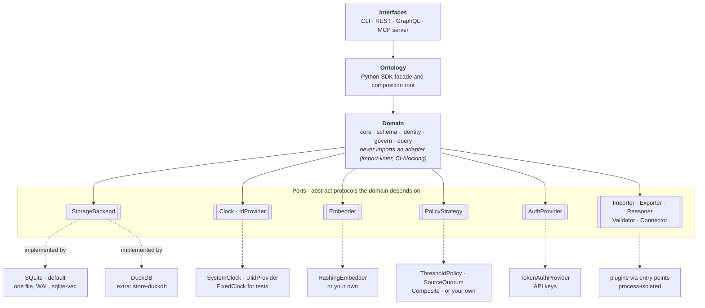

# Architecture

Ontolith uses ports and adapters (hexagonal architecture). The domain
packages depend only on abstract protocols. Storage, authentication,
embeddings, policy, and plugins all sit behind those protocols and can be
swapped. An `import-linter` contract in CI blocks any domain module from
importing a concrete adapter or interface — this is checked on every pull
request, not just documented as a convention.

The domain packages (`core`, `schema`, `identity`, `govern`, `query`)
depend only on abstract ports. Solid arrows are dependencies; dotted
arrows run from a port to the implementations that ship with it. The
`Ontology` facade is the composition root: it's the one place that picks
concrete implementations — `Ontology.connect()`, for example, constructs
the SQLite backend and defaults `policy` to `ThresholdPolicy`, `embedder`
to `HashingEmbedder`, and `clock` to `SystemClock` when none are given.

The bottom row mixes true adapters (SQLite, DuckDB, plugins) with pure
defaults that live inside the domain packages themselves (`FixedClock`,
`HashingEmbedder`, the policy strategies, `TokenAuthProvider`) — none of
those cross the dependency-rule boundary the way a real adapter does; they
just happen to be the shipped implementation of a port.

## What the dependency rule actually forbids

The `[tool.importlinter]` contract in `pyproject.toml` forbids `core`,
`schema`, `identity`, `govern`, and `query` from importing
`ontolith.store.sqlite`, `ontolith.store.duckdb`, `ontolith.interfaces`,
or `ontolith.observe`. This is enforced by `lint-imports` in CI — a domain
module importing a concrete adapter fails the build, not just a review.

## Design choices that shape the code

- **Determinism.** Domain code never calls `datetime.now()` or generates
  random IDs directly. Time and IDs come from injected `Clock` and
  `IdProvider` ports, so bitemporal behavior is reproducible in tests.
- **Pure policy.** A `PolicyStrategy` receives the proposal, the
  principal, and a read-only view, and returns `AutoAccept`,
  `RequireReview`, or `Reject`. It performs no I/O.
- **One transaction per acceptance.** Every write caused by accepting a
  proposal, including conflict handling, commits or rolls back together.
- **A reusable conformance kit.**
  [`conformance/`](https://github.com/ontolith/ontolith/tree/main/conformance/)
  holds the SPEC §19 test vectors. Any `StorageBackend` can run them to
  check its own behavior; the SQLite and DuckDB backends both do.
- **Plugins stay governed.** Plugins are discovered through the
  `ontolith.plugins` entry-point group and run in a separate process by
  default. A reasoner's derived facts go through the proposal path like
  any other write — no plugin bypasses governance.

The reasoning behind each of these lives in the
[Architecture Decision Records](https://github.com/ontolith/ontolith/tree/main/docs/adr/).
Good places to start: [ADR-0003](https://github.com/ontolith/ontolith/blob/main/docs/adr/ADR-0003-agent-identity.md)
(agent identity), [ADR-0005](https://github.com/ontolith/ontolith/blob/main/docs/adr/ADR-0005-conflict-model.md)
(conflict model), and [ADR-0008](https://github.com/ontolith/ontolith/blob/main/docs/adr/ADR-0008-mcp-surface.md)
(MCP surface).
