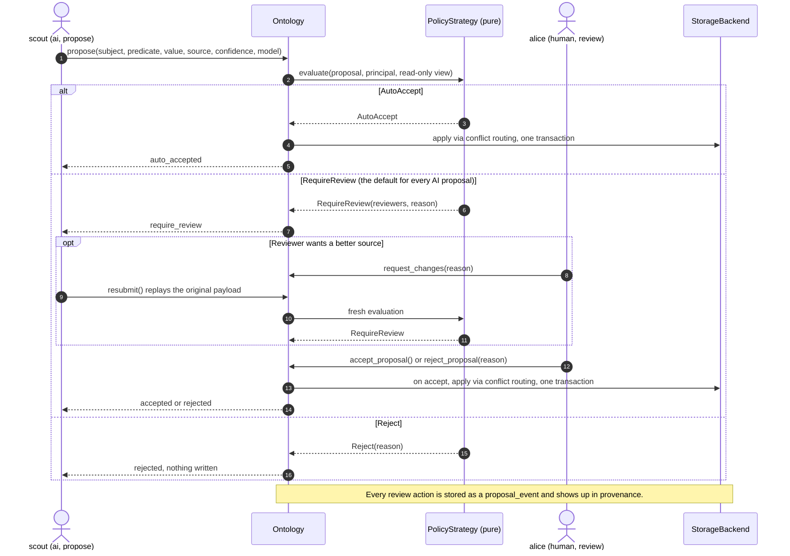

# Governance & Review

Full source:
[`examples/governance_and_review.py`](https://github.com/ontolith/ontolith/blob/main/examples/governance_and_review.py)

This tutorial walks through why AI principals can't write directly, and the
full review lifecycle a proposal goes through when it doesn't auto-accept.



## Why AI proposals always require review

Ontolith's capability lattice (`read < propose < write < review < admin`)
caps AI principals at `propose` by default — they submit proposals, they
never write directly. But even a `propose`-capability principal's proposal
*could* auto-accept under a permissive policy. The default
`ThresholdPolicy` (ADR-0003) deliberately doesn't allow that for AI authors:
**every AI-authored proposal requires human review, regardless of trust
level.**

```python
reviewer = kb.create_principal(
    "reviewer@example.com", kind="human", default_capability="admin", trust_level=8
)
researcher_bot = kb.create_principal(
    "researcher-bot", kind="ai", owner=reviewer.id,
    default_capability="propose", trust_level=6,
)
```

A human's write auto-accepts:

```python
proposal, decision = kb.propose(
    subject=acme.id, predicate="Company.headquarters", value="Springfield",
    value_type="Text", author=reviewer.id, source="internal records", confidence=1.0,
)
# decision is an AutoAccept; proposal.state == "auto_accepted"
```

The AI's proposal — even from a well-trusted principal — does not:

```python
proposal, decision = kb.propose(
    subject=acme.id, predicate="Company.headquarters", value="Metropolis",
    value_type="Text", author=researcher_bot.id, source="a news article",
    confidence=0.7, model="example-model-2026-01",  # required for AI authors
)
# decision is a RequireReview; proposal.state == "require_review"
```

`model` (the AI model family+version) is required provenance for any
AI-authored assertion — SPEC §7.4.

## The review lifecycle

A pending proposal can go three ways. This tutorial exercises all three:

```python
# A reviewer isn't convinced by the source and asks for a better one.
proposal = kb.request_changes(
    proposal.id, reviewer=reviewer.id,
    reason="Need a primary source, not a news article.",
)
# proposal.state == "changes_requested"

# The author (or a delegate) resubmits. resubmit() replays the ORIGINAL
# payload through a FRESH policy evaluation -- it doesn't let the author
# quietly swap in a different value while resubmitting.
proposal, decision = kb.resubmit(proposal.id, author=researcher_bot.id)

# The reviewer accepts it this time.
proposal = kb.accept_proposal(proposal.id, reviewer=reviewer.id)
# proposal.state == "accepted"
```

The third path ends a proposal terminally with no assertion ever written —
useful when a proposal shouldn't just be revised, it should be refused
outright. It needs a fresh, still-pending proposal (the one above is
already `accepted` by now — `reject_proposal()` only works on a proposal
still awaiting review):

```python
proposal, decision = kb.propose(
    subject=acme.id, predicate="Company.name", value="Extremely Legitimate Business Inc",
    value_type="Text", author=researcher_bot.id, source="an anonymous forum post",
    confidence=0.2, model="example-model-2026-01",
)
proposal = kb.reject_proposal(proposal.id, reviewer=reviewer.id, reason="Not a credible source.")
# proposal.state == "rejected"
```

## What happens to the assertion itself

`Company.headquarters` is a `static` property by default (temporality
isn't declared, so it defaults to `static`). The first assertion said
`"Springfield"`; the accepted AI proposal says `"Metropolis"` — a genuine
disagreement between sources on a fact that isn't supposed to change. SPEC
§10.3's routing kicks in: **both values are flagged as a contradiction**,
neither silently wins.

```python
active = kb.assertions(subject=acme.id, predicate="Company.headquarters", status="active")
flagged = kb.assertions(subject=acme.id, predicate="Company.headquarters", status="flagged")
# active  == []
# flagged == [<"Springfield">, <"Metropolis">]
```

`kb.assertions()` defaults to `status="active"` — flagged (disputed)
assertions are deliberately excluded from the default result set (SPEC
§10.3: "MUST be excluded from default retrieval unless explicitly
requested"). A `review`-or-above, non-AI principal resolves the dispute
explicitly with `resolve_contradiction()`; nothing here auto-resolves.

!!! note "Who can resolve this specific contradiction"
    Not `reviewer` in this example, despite being `admin` capability —
    `reviewer` authored one of the two contradicting values
    (`"Springfield"`), and a party to a contradiction can never resolve it
    themselves, regardless of capability (KI-026). Resolving this one
    needs a *different*, uninvolved `review`-or-above, non-AI principal.

If `Company.headquarters` had instead been declared `temporality=
"time_varying"` (see the [Bitemporal Queries tutorial](bitemporal-queries.md)),
the second value would have **superseded** the first instead of
contradicting it — the whole point of declaring temporality up front is
telling Ontolith which of these two behaviors you want.
